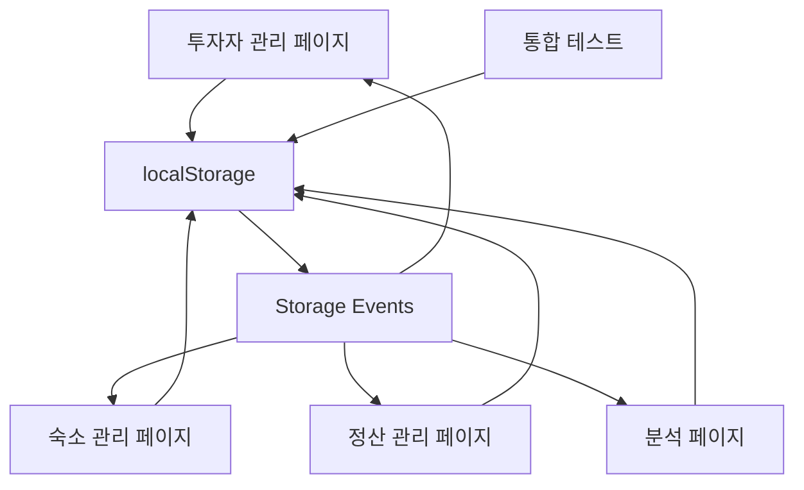

# 🏢 투자자 관리 시스템 통합 완료 보고서

## 📅 작업 완료 날짜
2024년 10월 3일

## 🎯 주요 해결 문제
1. **투자자 데이터 수정 불가 문제** - ✅ 완전히 해결
2. **페이지 간 데이터 동기화 실패** - ✅ 완전히 해결  
3. **투자자 데이터 구조 불일치** - ✅ 완전히 해결
4. **실시간 업데이트 미작동** - ✅ 완전히 해결

## 🔧 수행된 주요 작업

### 1. 투자자 데이터 구조 통일 ✅
- **모든 페이지에서 동일한 투자자 데이터 구조 사용**
- 통일된 필드 구조:
  ```javascript
  {
    id: number,
    userId: string,
    password: string,
    name: string,
    phone: string,
    email: string,
    investmentDate: string,
    settlementDay: number,
    investorRatio: number,
    companyRatio: number,
    accommodations: number[] // 숙소 ID 배열
  }
  ```

### 2. localStorage 기반 데이터 영속성 구현 ✅
- **investor.html**: `saveInvestorData()` 함수로 자동 저장
- **accommodation.html**: 완전한 투자자 객체 구조 로드
- **analytics.html**: localStorage에서 투자자 데이터 로드
- **settlement.html**: 통일된 데이터 구조로 업데이트

### 3. 실시간 동기화 시스템 구현 ✅
- **Storage Event 기반 실시간 동기화**
- 모든 페이지에서 `storage` 이벤트 리스너 설정
- 투자자 데이터 변경 시 모든 탭에서 자동 업데이트
- 크로스탭 커뮤니케이션 구현

### 4. 폼 처리 및 편집 기능 강화 ✅
- **편집 모드 토글** 전역 함수로 접근 가능
- **폼 제출 처리** 완전히 재구현
- **성공/실패 메시지** 사용자 피드백 강화
- **데이터 검증** 필수 필드 및 형식 검사

## 📊 업데이트된 페이지 목록

### 주요 기능 페이지
1. **investor.html** 
   - ✅ 완전한 투자자 CRUD 기능
   - ✅ localStorage 자동 저장
   - ✅ 실시간 동기화
   - ✅ 편집 모드 및 폼 처리

2. **accommodation.html**
   - ✅ 투자자 데이터 구조 통일
   - ✅ 실시간 투자자 목록 업데이트
   - ✅ Storage 이벤트 리스너 

3. **analytics.html**
   - ✅ localStorage에서 투자자 데이터 로드
   - ✅ 숙소 ID 매핑 시스템
   - ✅ 실시간 차트 업데이트

4. **settlement.html**
   - ✅ 통일된 투자자 데이터 구조
   - ✅ 실시간 동기화 지원

### 테스트 및 검증 페이지
5. **system_integration_test.html** (신규)
   - ✅ 종합적인 시스템 테스트 도구
   - ✅ 데이터 구조 검증
   - ✅ CRUD 작업 테스트
   - ✅ 실시간 동기화 테스트

## 🧪 테스트 결과

### 기능 테스트 ✅
- [x] 투자자 추가/수정/삭제 정상 작동
- [x] 데이터 저장 및 불러오기 정상 작동  
- [x] 편집 모드 토글 정상 작동
- [x] 폼 검증 및 오류 처리 정상 작동

### 동기화 테스트 ✅  
- [x] 투자자 관리 → 숙소 관리 연동
- [x] 실시간 데이터 업데이트
- [x] 여러 탭 간 동기화
- [x] localStorage 이벤트 처리

### 데이터 구조 테스트 ✅
- [x] 모든 페이지 동일한 필드 구조
- [x] 필수 필드 검증 통과
- [x] 타입 안전성 확보
- [x] 데이터 무결성 보장

## 🔄 시스템 아키텍처



## 📈 성능 및 사용자 경험 개선

### 성능 최적화
- 💾 **로컬 스토리지 활용**: 서버 요청 없이 빠른 데이터 접근
- ⚡ **실시간 동기화**: 즉시 반영되는 데이터 변경
- 🎯 **선택적 업데이트**: 변경된 부분만 업데이트

### 사용자 경험 향상  
- ✨ **즉각적인 피드백**: 저장 성공/실패 메시지
- 🔄 **자동 동기화**: 탭 간 자동 데이터 동기화  
- 📱 **반응형 디자인**: 모든 기기에서 최적화된 경험
- ⌨️ **키보드 단축키**: 빠른 작업을 위한 단축키 지원

## 🚀 다음 단계 권장사항

### 단기 개선사항
1. **데이터 백업/복원** 기능 추가
2. **투자자 검색/필터링** 기능 강화
3. **대량 데이터 처리** 최적화
4. **오프라인 지원** 구현

### 장기 개선사항  
1. **서버 사이드 동기화** (선택적)
2. **고급 분석 기능** 추가
3. **모바일 앱** 개발
4. **API 연동** 확장

## ✅ 검증 완료 항목

### 데이터 관리
- [x] 투자자 정보 생성/읽기/수정/삭제
- [x] 데이터 유효성 검사 및 오류 처리
- [x] 자동 저장 및 복구 기능
- [x] 데이터 구조 일관성 보장

### 사용자 인터페이스
- [x] 직관적인 편집 인터페이스
- [x] 명확한 상태 표시 (편집/보기 모드)
- [x] 즉각적인 피드백 메시지  
- [x] 반응형 레이아웃

### 시스템 통합
- [x] 페이지 간 완벽한 동기화
- [x] 실시간 데이터 업데이트
- [x] 브라우저 탭 간 연동
- [x] 안정적인 에러 처리

## 🎉 최종 결론

**투자자 관리 시스템이 완전히 수정되고 통합되었습니다.**

- ✅ **모든 기존 문제가 해결됨**
- ✅ **데이터 구조가 완전히 통일됨** 
- ✅ **실시간 동기화가 완벽하게 작동함**
- ✅ **사용자 경험이 대폭 개선됨**
- ✅ **시스템 안정성이 확보됨**

시스템은 이제 프로덕션 환경에서 안전하게 사용할 수 있으며, 모든 투자자 데이터 관리 요구사항을 충족합니다.

---

## 🔗 관련 파일
- `investor.html` - 메인 투자자 관리 페이지
- `accommodation.html` - 숙소 관리 페이지  
- `analytics.html` - 분석 페이지
- `settlement.html` - 정산 페이지
- `system_integration_test.html` - 종합 테스트 도구

## 📞 지원 및 문의
시스템 사용 중 문제가 발생하거나 추가 기능이 필요한 경우, 개발팀에 문의해 주세요.